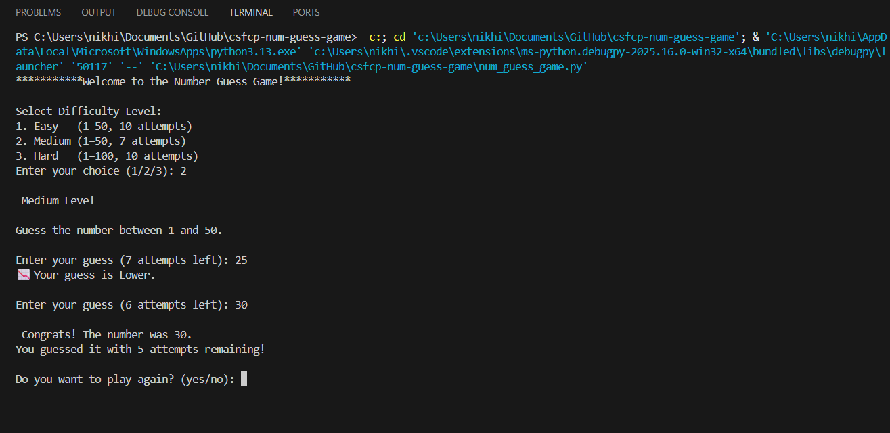

# Number Guess Game (Python)

A simple and fun command‑line number guessing game built in Python! The computer randomly selects a number, and the player must guess it in the fewest attempts possible.

---

## Project Description

This project is a beginner‑friendly Python application where:

* The program generates a random number.
* The user attempts to guess it.
* The program provides hints such as `Higher` or `Lower`.
* The game ends when the user guesses correctly or exhausts all attempts.

This is perfect for beginners learning Python basics like loops, conditionals, and user input.

---

## Installation & Usage

### **1. Clone or Download the Project**

```bash
git clone https://github.com/Nik-hil005/num-guess-game.git
cd num-guess-game.git
```

### **2. Run the Program**

Make sure Python is installed.

```bash
python num_guess_game.py
```

---

## Screenshots


### **Output Example**



---

## Features

* Random number generation
* Difficulty selection
* User interactive guessing loop
* Hints: "Higher" / "Lower"
* Tracks number of attempts
* Play again / Quit option
* Simple and clean terminal interface
* Beginner‑friendly Python code

---

## License

This project is open‑source and free to use.

---

## Contributions

Feel free to submit pull requests or open issues for improvements.
